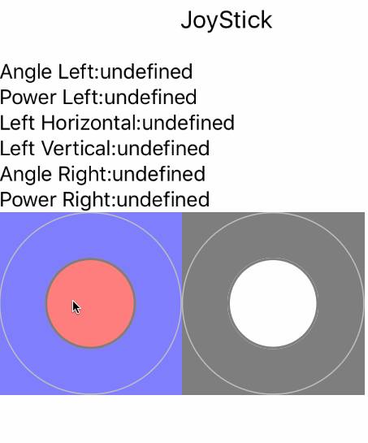

# NativeScript-JoyStick
An Android and iOS UI component for NativeScript that provides Virtual JoyStick



## Native Source

### Android
This component is based on [JoyStick component from AndroidArsenal](https://android-arsenal.com/details/1/2712) created by [erz05](https://github.com/erz05)

### iOS
This component is based on [JoyStick component from cocoapods](https://cocoapods.org/pods/CDJoystick) created by [Cole Dunsby](https://cocoapods.org/owners/9940)
And then modified to work better with Objective C, into [JoyStick another cocoapod](https://cocoapods.org/pods/CCDJoystick) by [tzraikov](https://github.com/tzraikov)

## Installation
From your command prompt/termial go to your app's root folder and execute:
`tns plugin add nativescript-joystick`

## Usage
#### XML:
```XML
<Page xmlns="http://schemas.nativescript.org/tns.xsd" loaded="pageLoaded"
  xmlns:js="nativescript-joystick">
  <StackLayout>
    <Label text="JoyStick"/>
    
    <Label text="{{'Angle:' + angle}}" textWrap="true" />
    <Label text="{{'Power:' + power}}" textWrap="true" />

    <js:JoyStick
      padColor="green"
      buttonColor="pink"
      width="50%"
      angle="{{angle}}"
      power="{{power}}"
      horizontal="{{horizontal}}"
      vertical="{{vertical}}">
    </js:JoyStick>
  </StackLayout>
</Page>
```

## Attributes
**padColor - (color string)** - *optional*

Attribute to specify the pad color to use.
 
**buttonColor - (color string)** - *optional*

Attribute to specify the button color to use.

**angle - (number)** - *optional*

Attribute (read only) to bind the button angle.
Values range -180 to 180. Where 0: Left, 90: Up, 180 and -180: Right, -90: Down 

**power - (number)** - *optional*

Attribute (read only) to bind the button power or how far it is from the centre.
Values range 0 to 100. Where 0: centre, 100: at the edge.

**horizontal - (number)** - *optional*

Attribute (read only) to bind the horizontal position of the button.
Values range -100 to 100. Where 0: centre, -100: left, 100: right.

**vertical - (number)** - *optional*

Attribute (read only) to bind the vertical position of the button.
Values range -100 to 100. Where 0: centre, -100: down, 100: up.

## Methods
- **getPower()** - returns current Power value directly from the native component
- **getAngle()** - returns current Angle value directly from the native component